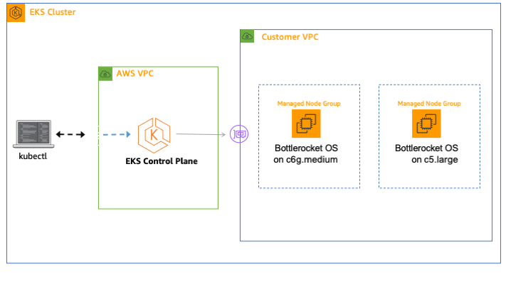

# Getting started with Bottlerocket on AWS Graviton2

In this post we bring Bottlerocket and Graviton2 technologies together by spinning up a Kubernetes cluster running Bottlerocket OS on Graviton2-based worker nodes. Since customers will incrementally migrate their x86-based workloads to Arm64-based, we expect their Kubernetes clusters to have a mix of both Graviton2 as well as x86-based EC2 instances. Hence I’ve chosen to showcase that use case here. We’ll deploy a EKS cluster composed of two Managed Node Groups, one configured with x86-based and the other with Graviton2-based EC2 instance type, both of which utilize Bottlerocket-based AMI.

## Solution Overview

We’ll program our infrastructure using Python programming with CDK. This allows us to leverage a high-level programming language such as Python which acts as a layer of abstraction on top of the underlying CloudFormation template that CDK generates. 

**NOTE**: Although AWS EKS API provides a way to add a Managed Node Group by specifying EC2 instance type and AMI type, it does not work today for Bottlerocket AMI type. This feature is currently being developed by the AWS EKS team and will be made available in the near future. Hence, in our solution here we achieve the same outcome in a slightly different manner by defining a Launch Template with a custom AMI. The custom AMI will be a Bottlerocket AMI corresponding to the CPU processor architecture of the specific EC2 instance type. We then refer to the launch template in the EKS cluster API call to add Managed Node Group.

The following diagram illustrates this architecture:



## Walkthrough

The key steps in setting up this HelloWorld container on Bottlerocket Container OS powered by Graviton2 EC2 instance type are as follows:

* Initialize parameters in AWS SSM Parameter Store to keep Dockerhub username and password
* Fetch the code and explore the infrastructure code and the application code
* Create the EKS cluster and the build pipeline infrastructure
* Check out the Bottlerocket OS running on Graviton2 and x86 worker nodes
* Push the Helloworld application code to CodeCommit to trigger build pipeline
* Testing the solution

### Prerequisites

For this walk-through, you should have the following prerequisites: 

* Install AWS CLI along with AWS Session Manager plugin. We'll be using the default profile for the AWS CLI, so do make sure to configure this profile with the intended AWS Region and appropriate AWS credentials.
* Setup [Https Git credentials](https://docs.aws.amazon.com/codecommit/latest/userguide/setting-up-gc.html) for the IAM user you will utilize for this exercise. This will be utilized to commit application code to CodeCommit. 
* Install CDK. Follow the [prerequisites and install guidance](https://docs.aws.amazon.com/cdk/latest/guide/getting_started.html#getting_started_prerequisites). CDK will be used to deploy the application and deployment pipeline stacks
* Install Kubectl. Follow these [instructions](https://kubernetes.io/docs/tasks/tools/install-kubectl/), as kubectl will be used to communicate with the cluster created by EKS.
* Create Docker Hub account and access token in [Docker Hub](https://hub.docker.com/settings/security). The username and token will be used to pull images from Docker Hub during the build phase of CodePipeline.

### Initialize parameters in AWS SSM Parameter Store

Initialize parameters in AWS Systems Manager Parameter Store for Dockerhub username and password. 
In order to simplify the steps in this particular example of mine, I’ve chosen to use a plain text data type for storing the Dockerhub password. However, do make sure to secure it in your own environment by utilizing a more secure data type such as SecureString along with an encryption key.

Execute the below commands to create two parameters in SSM Parameter Store after substituting the DOCKERHUB-USERNAME and DOCKERHUB-PASSWORD with your Dockerhub user name and password. 

```
aws ssm put-parameter --name "/hello-bottlerocket/dockerhub/username" --type "String" —value DOCKERHUB-USERNAME
aws ssm put-parameter —name "/hello-bottlerocket/dockerhub/password" —type "String" —value DOCKERHUB-PASSWORD
```

### Fetch the code and explore the setup

Fetch the code by doing a git clone on this repository.

```
git clone git@github.com:aws-samples/amazon-eks-bottlerocket-nodes-on-graviton2.git hello-bottlerocket
```

The folder ‘cdk’ contains the code to build an EKS cluster and a build pipeline infrastructure. They are located in the ‘container_infra’ and ‘build_infra’ folders respectively. 

The application code can be found in the folder ‘app’. It’s a simple Helloworld Go application that prints the environment it’s running on. The app folder also contains a Dockerfile and a Kubernetes manifest file for the application. The manifest mainly consists of a Deployment and a Service definition.

Once the infrastructures are deployed, we will then commit the application code into the newly created CodeCommit repository to trigger the build pipeline for application deployment.


### Create the EKS cluster and the build pipeline

1. Setup the environment

   ```
   cd hello-bottlerocket/cdk
   python3 -m venv .env
   ```

2. Run the cdk-deploy-to.sh script that utilizes CDK to deploy both a EKS cluster and a build pipeline.

   ```
   # REPLACE ACCOUNT-ID and REGION with your AWS account number and region
   cdk-deploy-to.sh <ACCOUNT-ID> <REGION>
   ```

   Depending upon your security settings, it will prompt you to confirm that the required IAM and Security Policy changes are acceptable to you. If this looks good to you, confirm by entering ‘y’ at the prompt.

   Once the EKS cluster stack gets deployed, it will prompt you to confirm for deploying the build pipeline stack. Before you proceed, make sure to copy the command that you need to run later to configure Kubectl config. The command will be shown as the value of the CDK output parameter 'container-infra-stack.EKSConfigCommand&lt;ID&gt;'

   ```
   Outputs:
   container-infra-stack.EKSConfigCommand<ID> = aws eks update-kubeconfig --name EKSE2753513-1a6b2d1a8893480bb1302380ade563ea --region us-east-2 --role-arn arn:aws:iam::411317953072:role/container-infra-stack-EKSMastersRole2941C445-ZIUVEDAMSV2I_
   ```

   Similar to the previous prompt, it is asking for confirmation that the security related changes needed as part of deploying the build pipeline stack are acceptable. If this looks good to you, confirm by entering ‘y’ at the prompt.

   After the build pipeline stack has been deployed, make a note of the output for the CodeCommit repository URL. This is required in a later step to trigger the deployment of the sample Hello world application container. This URL will be shown as the value for the CDK output parameter 'build-infra-stack.CodeCommitOutputrepositoryurl'

   ```
   Outputs:
   build-infra-stack.CodeCommitOutputrepositoryurl = https://git-codecommit.us-east-2.amazonaws.com/v1/repos/hello-bottlerocket-multi-cpu-arch
   ```

### Check out the Bottlerocket OS running on Graviton2 and x86 worker nodes

1. Update Kube config to allow Kubectl to connect to the newly created EKS cluster. This command was generated in the previous step when CDK deployed the EKS cluster and you made a copy of it. It’s the value from the output parameter named 'container-infra-stack.EKSConfigCommand&lt;ID&gt;'

   ```
   aws eks update-kubeconfig --name EKSE2753513-1a6b2d1a8893480bb1302380ade563ea --region us-east-2 --role-arn arn:aws:iam::411317953072:role/container-infra-stack-EKSMastersRole2941C445-ZIUVEDAMSV2I
   ```

2. List the worker nodes in the EKS cluster along with the attributes that is of interest to us

   ```
   $ kubectl get nodes -o=custom-columns=NODE:.metadata.name,ARCH:.status.nodeInfo.architecture,OS-Image:.status.nodeInfo.osImage,OS:.status.nodeInfo.operatingSystem

   NODE                                        ARCH   OS-Image               OS
   ip-10-0-101-226.us-east-2.compute.internal  arm64  Bottlerocket OS 1.0.7  linux
   ip-10-0-187-156.us-east-2.compute.internal  amd64  Bottlerocket OS 1.0.7  linux
   ```


3. Check the configuration settings of the Bottlerocket OS running on the worker node

   Since we had enabled the SSM permission for the node instance role of the worker nodes, AWS SSM agent should be running on the node and so we can access it through a session via SSM service. We just need the worker node EC2 instance’s id for launching a session. Let’s find the instance id by running this command to describe instances.

   ```
   $ aws ec2 describe-instances --query Reservations[*].Instances[*].[InstanceId] --output text

   i-08f2426c826d38ad5
   i-068d8f40c6c90a596
   ```

   Choose either of the two instance id and launch a SSM session.


   ```
   $ aws ssm start-session --target i-08f2426c826d38ad5

   Starting session with SessionId: eks-course-0bf27ea1e078f5c40
   Welcome to Bottlerocket's control container!
   ```


   You can run a query on the Control container on this instance for listing the current config settings of the Bottlerocket OS by utilizing the ‘apiclient’ tool, as shown below.
   ```
   ./apiclient -u /settings
   ```

   You can view key details in its output, such as the node IP address, DNS settings, MOTD, update URLs and enable status of the admin container.

   You could also see the CPU architecture that the container is running on by looking at the output of the ‘uname’ command.

   ```
   $ uname -a

   Linux ip-10-0-101-226.us-east-2.compute.internal 5.4.95 #1 SMP Wed Mar 17 19:45:21 UTC 2021 aarch64 aarch64 aarch64 GNU/Linux
   ```

   As you can see in the above output, the ‘aarch64’ implies that this Control container is hosted on the EC2 worker node that is part of the EKS Node Group configured with Graviton2 instance type. You can now exit from the SSM session.


### Push the application code into CodeCommit repository to trigger the build pipeline

1. CodeCommit created a code repository in the above step. Checkout this code repository to a local folder. Let’s place this folder at the same level as the ‘hello-bottlerocket’ folder where you cloned the code initially. Let’s call it  ‘developer-repo’

   ```
   cd ../..
   # REPLACE build-infra-stack.CodeCommitOutputrepositoryurl with its value you saved earlier
   git clone <build-infra-stack.CodeCommitOutputrepositoryurl> developer-repo
   ```

2. Copy our application code from the above cloned repository to the ‘developer-repo’ folder

   ```
   cp -R hello-bottlerocket/* developer-repo/
   ```

3. Commit the code and push to the master repository in Codecommit. When prompted, you'll need to provide the HTTPS Git credentials that you had setup in the Prerequisite step
 
   ```
   cd developer-repo
   git add -A
   git commit -m "trigger app deployment build pipeline"
   git push
   ```

4. Monitor the build in CodePipeline via the AWS Console to ensure that our build pipeline completed successfully. This usually takes a few minutes.

### Testing the solution

1. Verify that our application pods are up and running. Also make a note of the worker node IP addresses they are hosted on.

   ```
   $ kubectl get pods -o wide

   NAME READY  STATUS RESTARTS  AGE  IP  NODE  NOMINATED NODE  READINESS GATES
   hello-bottlerocket-78f56897c8-hz98l  1/1  Running  0 14h  10.0.123.184  ip-10-0-101-226.us-east-2.compute.internal  <none>  <none>
   hello-bottlerocket-78f56897c8-s52v6  1/1  Running  0 14h  10.0.165.236  ip-10-0-187-156.us-east-2.compute.internal  <none>  <none>
   ```

2. Obtain the URL to our newly deployed service. You need to wait for about couple minutes before the NLB load balancer is successfully provisioned after our build pipeline completes.

   ```
   $ kubectl get services

   NAME  TYPE  CLUSTER-IP  EXTERNAL-IP  PORT(S) AGE
   hello-bottlerocket  LoadBalancer  172.20.92.75  aab8c97bf6d9f46788792b4319c83fab-008d9b125aa48ae5.elb.us-east-2.amazonaws.com  80:30493/TCP  14h
   kubernetes  ClusterIP 172.20.0.1  <none> 443/TCP 15h
   ```

3. Let’s access our application to see our Hello world application in action.

   ```
   $ curl http://aab8c97bf6d9f46788792b4319c83fab-008d9b125aa48ae5.elb.us-east-2.amazonaws.com

   Hello there!!!
   I'm running on {cpuArch: arm64, nodeName: ip-10-0-101-226.us-east-2.compute.internal}
   ```


   For this application request the load balancer sent it to the application pod running on the Graviton2 based EC2 instance worker node as indicated by the value ‘arm64’ for the value of the ‘cpuArch’ field in the output.

   If you try it a few more times you’ll notice that the request get serviced by the second application pod running on the x86 based EC2 instance worker node, like in the output shown below as ‘amd64’.

   ```
   $ curl http://aab8c97bf6d9f46788792b4319c83fab-008d9b125aa48ae5.elb.us-east-2.amazonaws.com

   Hello there!!!
   I'm running on {cpuArch: amd64, nodeName: ip-10-0-187-156.us-east-2.compute.internal}
   ```


### Cleanup

Tear down the infrastructure you created in this post by executing the cleanup script provided.

```
cd ../hello-bottlerocket/cdk

# REPLACE ACCOUNT-ID and REGION with your AWS account number and region
./cleanup.sh <ACCOUNT-ID> <REGION>
```

Please note that CDK bootstraps a stack named ‘CDKToolkit’ in CloudFormation as part of deploying our container and build pipeline stacks, in case your environment didn’t have it existing previous to running this exercise. This stack provides a S3 bucket that CDK deploy will use to store synthesized templates and the related assets. By default, this bootstrap stack will be protected from stack termination. So if the stack was not existing prior to running this exercise, make sure to delete it manually after emptying the objects in the corresponding S3 bucket. This way you can avoid incurring future charges on your AWS account.

## License

This project is licensed under the MIT-0 License.
